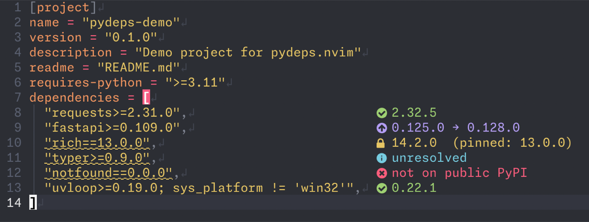
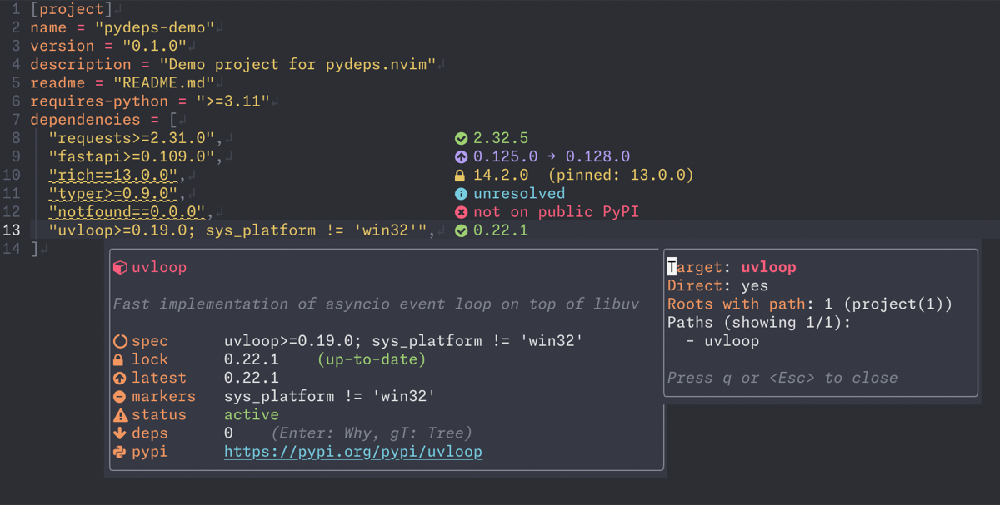
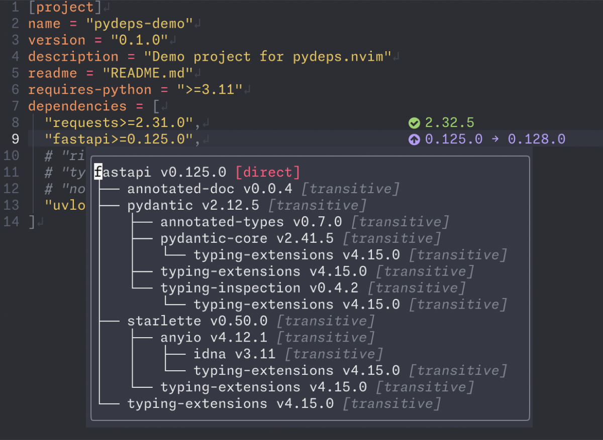
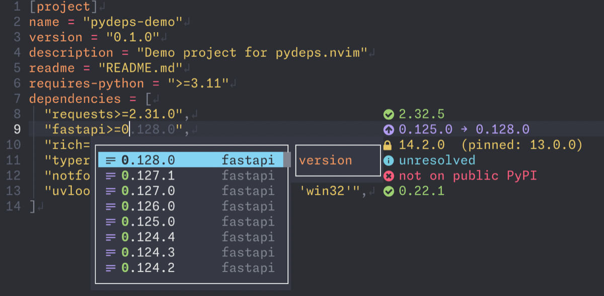

# pydeps.nvim

[](https://github.com/mhiro2/pydeps.nvim/releases/latest)
[](https://github.com/mhiro2/pydeps.nvim/actions/workflows/ci.yaml)

Lockfile-first dependency explorer for Python — focused on **resolved versions**, **real environments**, and **uv-powered workflows**.

pydeps.nvim treats **lockfiles as first-class citizens** and integrates directly with modern Python tooling such as `uv`.

## 🎬 Demo

### Inline Badges



### `:PyDepsInfo`



### `:PyDepsTree`



### Completion



## 💡 Why pydeps.nvim?

Most Python dependency plugins answer:
> "What is the latest version?"

pydeps.nvim answers:
> "What version will actually be installed, and why?"

Key differences:
- **Lockfile-first**: Shows what WILL be installed, not what COULD be installed
- **Environment-aware**: Full PEP 508 marker evaluation (Python version, platform, extras, groups)
- **Modern tooling**: Deep integration with `uv` instead of generic pip/requirements
- **Editor-native workflow**: Review lockfile changes before committing

pydeps.nvim brings the **crates.nvim workflow to Python** with a focus on what will actually run in your environment.

## ✨ Features

### Core

- 🔒 **Lockfile-first view**: show **resolved** versions from `uv.lock`
- 🧭 **Why-installed tracing**: understand **dependency provenance**
- 🧪 **PEP 508 aware**: markers for Python version, platform, extras, and groups
- 🧩 **Inline badges**: section-aligned, comment-aware UI with icons & highlights
- ⚡ **Review-first resolve**: `uv lock` + lockfile diff before committing
- 🧰 **Mismatch detection**: pin vs resolved version + yanked checks on PyPI

### Optional

- 🌳 **Dependency tree**: inspect with `uv tree`
- 📡 **PyPI info & diagnostics**: metadata-backed details in editor
- ⌨️ **Smart completion**: packages / versions / extras / groups (nvim-cmp, blink.cmp)

## 📁 Supported Files

- `pyproject.toml`
- `uv.lock`

## 📦 Requirements

- Neovim ≥ 0.10
- `uv`
- `nvim-treesitter` with `toml` parser (required for accurate inline badge alignment and comment-aware positioning)

## 🚀 Installation

```lua
{
  "mhiro2/pydeps.nvim",
  config = function()
    require("pydeps").setup()
  end,
}
```

## ⚙️ Configuration

pydeps.nvim is configurable via `require("pydeps").setup({ ... })`.

<details><summary>Default Settings</summary>

```lua
{
  show_virtual_text = true,
  show_missing_virtual_text = true,
  show_missing_lockfile_virtual_text = true,
  missing_lockfile_virtual_text = "missing uv.lock",
  ui = {
    enabled = true,
    section_padding = 4,
    icons = {
      enabled = true,
      searching = "",
      loading = "",
      update = "",
      ok = "",
      inactive = "󰍶",
      yanked = "󰀪",
      lock_mismatch = "",
      pin_not_found = "",
      unknown = "󰋼",
      package = "",
      spec = "",
      lock = "",
      latest = "",
      extras = "",
      markers = "󰍶",
      status = "",
      deps = "",
      pypi = "󰌠",
      fallback = {
        searching = "?",
        loading = "~",
        update = "^",
        ok = "=",
        inactive = "-",
        yanked = "!",
        lock_mismatch = "!",
        pin_not_found = "x",
        unknown = "?",
      },
    },
    show = {
      resolved = true,
      latest = true,
    },
    status_text = {
      searching = "Searching",
      loading = "Loading",
    },
  },
  auto_refresh = true,
  refresh_debounce_ms = 200,
  info_window_border = "rounded",
  select_menu_border = "rounded",
  select_menu_relative = "cursor",
  notify_on_missing_lockfile = true,
  enable_diagnostics = true,
  diagnostic_severity = {
    yanked = vim.diagnostic.severity.WARN,
    marker = vim.diagnostic.severity.WARN,
    lock = vim.diagnostic.severity.WARN,
  },
  pypi_url = "https://pypi.org/pypi",
  pypi_cache_ttl = 3600,
  enable_completion = true,
  completion = {
    pypi_search = true,
    pypi_search_min = 2,
    max_results = 30,
  },
}
```

</details>

## 🎨 Customizing Highlights

pydeps.nvim uses treesitter-based highlight groups for a modern, theme-consistent appearance. You can customize any highlight group using `:highlight` after setup:

```lua
-- Customize info window highlights
vim.api.nvim_set_hl(0, "PyDepsInfoUrl", { link = "@markup.link.url" })
vim.api.nvim_set_hl(0, "PyDepsInfoPackage", { link = "Title", bold = true })

-- Customize virtual text badges
vim.api.nvim_set_hl(0, "PyDepsOk", { link = "DiagnosticOk" })
vim.api.nvim_set_hl(0, "PyDepsUpdate", { link = "DiagnosticWarn" })

-- Customize tree badges
vim.api.nvim_set_hl(0, "PyDepsBadgeDirect", { link = "@keyword" })
vim.api.nvim_set_hl(0, "PyDepsBadgeExtra", { link = "@constant" })
```

**Available highlight groups:**

- **Info Window**: `PyDepsInfoPackage`, `PyDepsInfoDescription`, `PyDepsInfoLabel`, `PyDepsInfoValue`, `PyDepsInfoUrl`, `PyDepsInfoVersion`, `PyDepsInfoPill`, `PyDepsInfoStatus*`, `PyDepsInfoSuffix*`
- **Virtual Text**: `PyDepsOk`, `PyDepsUpdate`, `PyDepsMajor`, `PyDepsYanked`, `PyDepsInactive`, `PyDepsLockMismatch`, `PyDepsPinNotFound`, `PyDepsUnknown`, `PyDepsResolved`, `PyDepsMissing`, `PyDepsLabel`, `PyDepsSearching`, `PyDepsLoading`
- **Tree Badges**: `PyDepsBadgeDirect`, `PyDepsBadgeTransitive`, `PyDepsBadgeGroup`, `PyDepsBadgeExtra`

See `:help pydeps-highlights` for the complete list and default links.

## ⌨️ Completion

pydeps completes PEP 508-style dependency strings in `pyproject.toml` and related files.
It works with both **nvim-cmp** and **blink.cmp**.

**What you can complete:**
- **Package names**: PyPI search suggestions (min 2 chars)
- **Versions**: type a constraint (`==`, `>=`, `~=`, etc.) → release versions
- **Extras**: type `[` inside a package spec → available extras
- **Markers**: type `;` → marker keys/values (`extra`, `group`, `platform_system`, etc.)

**Examples:**
- `requests[security]>=2.31; python_version >= "3.11"`
- `fastapi ~= 0.110`

### nvim-cmp

```lua
require("cmp").setup({
  sources = {
    { name = "pydeps" },
    -- other sources...
  },
})
```

### blink.cmp

```lua
require("blink.cmp").setup({
  sources = {
    default = { "pydeps" },
  },
  providers = {
    pydeps = {
      name = "pydeps",
      module = "pydeps.completion.blink",
    },
  },
})
```

## 💻 Commands

- `:PyDepsToggle` — toggle inline badges and diagnostics
- `:PyDepsUpdate [package]` — update dependency under cursor (or named package)
- `:PyDepsResolve` — resolve dependencies via `uv` and show lockfile diff
  - `:PyDepsResolve!` shows diff only (no lock)
- `:PyDepsWhy [package]` — show transitive provenance for dependency
- `:PyDepsInfo` — inspect dependency under cursor
- `:PyDepsTree` — show dependency tree (uses `--frozen` by default)
  - `:PyDepsTree --resolve` skips frozen mode and attempts dependency resolution

Run `:checkhealth pydeps` to verify your setup.

## 📚 Documentation

See `:help pydeps` for complete documentation.

## 🔀 Alternatives

If you primarily manage dependencies via `requirements.txt`-style workflows, [py-requirements.nvim](https://github.com/MeanderingProgrammer/py-requirements.nvim/tree/main) is a solid choice.
pydeps.nvim is optimized for **lockfiles** and **`uv`-based** environments, so the best fit depends on how your project is managed.

Quick differences:
- **pydeps.nvim**: lockfile-first, resolved dependency view, `uv.lock` integration
- **py-requirements.nvim**: requirements-first, declared dependency view

## 📄 License

MIT License. See [LICENSE](./LICENSE).
